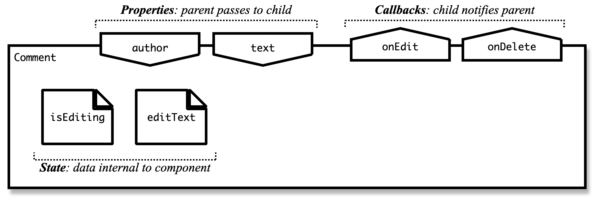
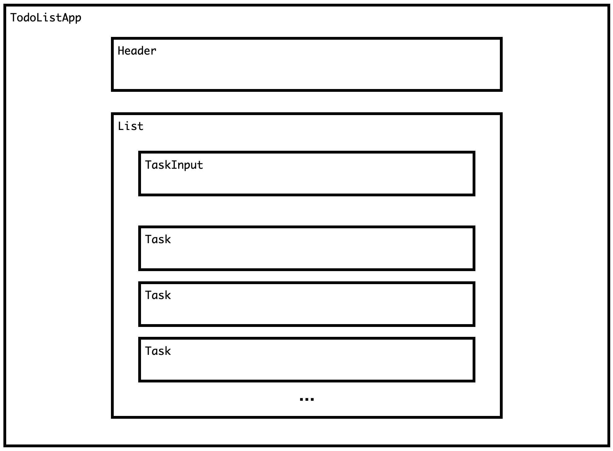
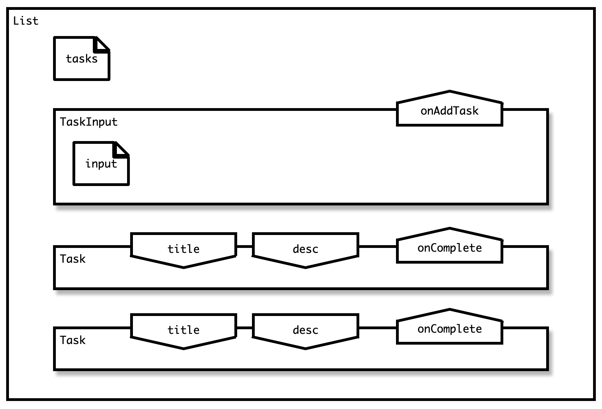
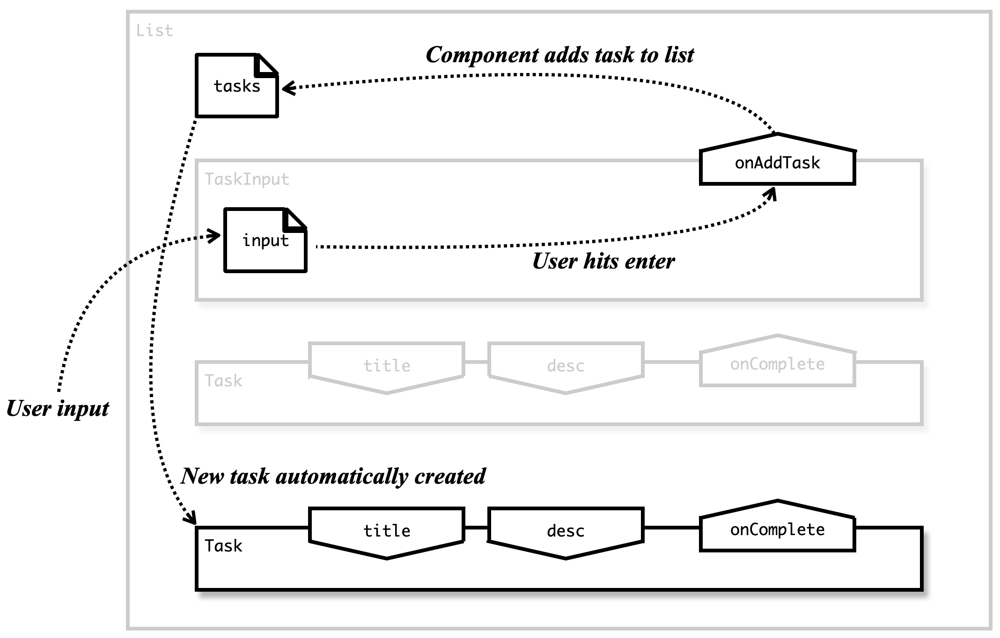

# Understanding Web Frameworks

<!-- slide-front-matter class: center, middle -->

## Summary

Learn what web frameworks are and how they are useful when developping a web application.

<!-- slide-include ../../BANNER.md -->

<!-- START doctoc generated TOC please keep comment here to allow auto update -->
<!-- DON'T EDIT THIS SECTION, INSTEAD RE-RUN doctoc TO UPDATE -->


- [Traditional Client/Server architecture](#traditional-clientserver-architecture)
- [Traditionnal Browsing Experience](#traditionnal-browsing-experience)
  - [Server Frameworks](#server-frameworks)
  - [Sidenote: About Frameworks](#sidenote-about-frameworks)
- [JavaScript Incoming](#javascript-incoming)
- [Single Page Application](#single-page-application)
- [Architectural Chaos](#architectural-chaos)
- [Architectural Patterns](#architectural-patterns)
- [The Contenders Are...](#the-contenders-are)
- [Declarative frameworks](#declarative-frameworks)
- [Component-based frameworks](#component-based-frameworks)
  - [What is a component?](#what-is-a-component)
  - [Example - Building a Todo App](#example---building-a-todo-app)
  - [Example - Building a Todo App (2)](#example---building-a-todo-app-2)
  - [Example - Building a Todo App (3)](#example---building-a-todo-app-3)
  - [Example - Building a Todo App (4)](#example---building-a-todo-app-4)
  - [Example - Todo App flow](#example---todo-app-flow)
  - [Example - Todo App - Responsibilities](#example---todo-app---responsibilities)

<!-- END doctoc generated TOC please keep comment here to allow auto update -->

<!--
  - TODO: Frontend VS Backend
  - TODO: Single Page Applications
  - TODO: MVVM Architectural pattern
  - TODO: Web Frameworks
 -->

## Traditional Client/Server architecture

<!-- Where we talk about how internet revolves around clients and servers -->

The internet world is mainly composed of **clients**, i.e. users' devices (phone, tablet, computer), and **servers**, i.e. computers that store and provide websites or webapps.

<p style="text-align: center">
  
</p>

When navigating the internet, your browser asks one or several servers for data, and then displays on the screen of your device.

## Traditionnal Browsing Experience

<!-- Where we see an overview of how browsing a website is basically done -->

A website is essentially a collection of `.html` files interpreted and displayed by your browser. Those files are stored or generated by a server that sends them to your browser on request.

Traditionnaly, the server returns one complete HTML page per request, triggering a full re-render by the browser, noticeable by the user.

<p class="center"></p>

> You can see this behavior when navigating [Wikipedia](https://fr.wikipedia.org) for example.

### Server Frameworks

This traditionnal approach is still used today by many popular server frameworks (e.g. Laravel, Spring Boot, Ruby on Rails, etc).

They often use the **MVC** architectural pattern.


### Sidenote: About Frameworks

**What is a framework?**

A framework is designed to ease the creation of a specific type of application by providing a set of tools and libraries that you will likely need when developing it.

**Why are they useful?**

Frameworks provide useful building blocks and helpful utilities, allowing you to forget about tedious, repetitive and often **complex development tasks** (routing, security, validation, etc).

They also are often designed so that working with them forces you (to some extent) to **follow good programming practices, principles, and patterns**.

> MVC Frameworks expect you to build your app following the principles of this architectural pattern, for example

## JavaScript Incoming

Initially, JavaScript was used mainly for **animation and interactivity**, using DOM manipulation libraries like [**jQuery**][jquery].

JavaScript then became capable of making HTTP requests **without triggering a full page reload** by the browser (a.k.a. asynchronous requests).

<!-- slide-column 60 -->

This lead to the development of the concept called **AJAX (Asynchronous JavaScript And XML)**, which drastically changed the way web pages were conceived.

AJAX is the set of techniques that allow your app to load data from the server *in the background*, and update only part of the page, hence avoiding a full page reload.

<!-- slide-column 40 -->


<!-- slide-column 100 -->

Initially, AJAX was used to **enrich** HTML apps that were still built and served by a traditional MVC framework.

## Single Page Application

<!-- slide-column -->

AJAX principles then started being used on the entire app, rather than just a few parts of it. The whole app was now a **single page** updating its contents dynamically. We call those **Single Page Applications** (SPA).

<!-- slide-column 50 -->

A SPA fits on a single web page (`.html` file), but provides all required features, similarly to a desktop application.

- All content is retrieved **on initial page load**, or **dynamically**.
- The page **never reloads**.
- The page communicates with the server **in the background**.

> You can see this behavior when navigating [Twitter](https://twitter.com) for example.

<!-- slide-column 50 -->


## Architectural Chaos

<!-- Where we discuss about the emergeance of JavaScript applications -->

With the explosion of SPAs and jQuery usage (which made AJAX requests easier), the JavaScript development ecosystem **looked like the Wild West**. Everyone was trying to figure out the best way to **organize, structure and develop frontend web applications** using extensive JavaScript code.

Libraries were created, became huge hits and extremely popular, only to be replaced month laters by another library ; many tools were created, often to address similar or identical issues, generating much heated debate (👋 Grunt VS Gulp)...

Then, little by little, things started to settle down, the ecosystem matured (thanks to `npm` and its packages) and **some design became wildly accepted**.

## Architectural Patterns

One of those is the architectural pattern called MVVM, for:

"**M**odel - **V**iew - **V**iew**M**odel"

Despite the confusing name, it is not so different from the classical **MVC** pattern:

- The **Model** still represents the data with which we work. Except that, instead of being retrieved from a database, in the context of a frontend framework, the data is retrieved **by requesting it from the server**.
- The **View** sill represents the User Interface with which the user interacts.
- Even though the names are different, the **ViewModel** is very similar to the **Controller** in MVC: it is the link between the **Model** and the **View**. It holds the data used by the view, reacts to the user interactions on the view, and manipulates the model if necessary.

> One major difference between MVC and MVVM is that, in MVC, the main entry point is the **Controller**, where in MVVM, it's the **View**.

## The Contenders Are...

Many frontend JS framworks are based on this pattern which helps to apply **separation of concerns**. They implement it in different ways, depending on their philosophy, but the underlying concepts are **pretty similar**.

As of today, among the [vastitude of existing frontend frameworks][stjs], the top three contenders are, in order of "hotness":

- [React][react] - Developped and backed by a team at Facebook
- [Vue.js][vue] - Created by Evan You, developped by an open source community
- [Angular][ng] - Developped and backed by a team at Google

All three of them do things their way, have different learning curves, different popularity, their own pros and cons, but they are equally performant and viable solution for your projects.

> In this course, we decided to go for **Vue.js**, mainly because its the one with the **easiest learning curve**, and which requires less basic knowledge (no TypeScript of JSX required).

## Declarative frameworks

All three of these frameworks are **declarative**.

In a **declarative** framework, you describe **what you want to see**, not **how it needs to be done**. The framework figures out what to do to make it look the way you asked.

As an example in VueJS, you would write:

```html
<input v-model="name" />
<p>Hi, {{ name }}!</h1>
```

instead of
  
```html
<input id="name" />
<p id="greeting"></p>
<script>
  document.getElementById('name').addEventListener('input', function (event) {
    document.getElementById('greeting').innerText = 'Hi, ' + event.target.value + '!';
  });
</script>
```

## Component-based frameworks

One kind of declarative framework is the **component-based** framework, which VueJS, React and Angular are as well.

In a component-based framework, your app is split into **small**, **reusable**, **single-purpose** components, used throughout the app.

<p align="center">
  
</p>
<sup>[**Source**][cpt-composition]</sup>

### What is a component?

A component is usually defined by
- its **state**, i.e. data internal to the component, that can change over time
  - *(e.g. whether a button is disabled or not, the text of a label, etc.)*
- its **children**, i.e. the components it contains
- **properties**, i.e. data provided by the parent component
- a **template**, describing how all of this comes together visually

It is usually also able to send information to its parent, through **callbacks**.

<p align="center">
  
</p>

### Example - Building a Todo App

<p align="center">
  
</p>

What **state**, **properties** and **callbacks** do we need?

### Example - Building a Todo App (2)

We'll need to **store the list** of tasks somewhere. *This will be state*.

We'll also need to **tell each task its title and description**. *This will be done through properties*.

Finally, we'll want to **remove and add tasks** to the list, on user interaction. *This will be done through callbacks*.

### Example - Building a Todo App (3)

The list of tasks will be stored by the `List` component, which will contain one `Task` component per task, and a `TaskInput` component to add new tasks.

The `Task` components will take their title and description as **properties**, and will be able to notify their parent when they're completed through a **callback**.

The `TaskInput` component will have additional internal **state** to represent text being typed in by the user, and will be able to notify its parent when a new task is added through a **callback**.

The `List` component will thus update the list of tasks when notified to do so by its children.

???

- The `List` component
  - holds the list of tasks as **state**,
  - contains one `Task` component per task in the list,
  - contains a `TaskInput` component to add new tasks.
- The `Task` component
  - needs no state,
  - takes the task's `title` and `desc` as **properties**,
  - can notify its parent when it's completed through a **callback**.
- The `TaskInput`
  - holds the text being typed by the user in as **state**,
  - can notify its parent when a new task is added through a **callback**.

### Example - Building a Todo App (4)

<p align="center">
  
</p>

### Example - Todo App flow

<p align="center">
  
</p>

### Example - Todo App - Responsibilities

The developer is responsible for
- Describing the **states**, **properties** and **callbacks** of each component
- Describing **how state should change** on user interactions and callbacks
- Describing **what components should look like**.

The framework is responsible for
- Knowing **when** to change the state,
- **Detecting** state changes,
- **Re-rendering** any component whose state has changed.

Essentially, you **describe** the app, the framework maintains it **as described**.

[jquery]: https://jquery.com/
[ajax]: https://developer.mozilla.org/en-US/docs/AJAX/Getting_Started
[stjs]: https://2019.stateofjs.com/front-end-frameworks/
[react]: https://fr.reactjs.org/
[vue]: https://vuejs.org/
[ng]: https://angular.io/
[cpt-composition]: https://stackoverflow.com/questions/46614002/possible-to-use-vuejs-sfc-components-with-with-template-in-rendered-html